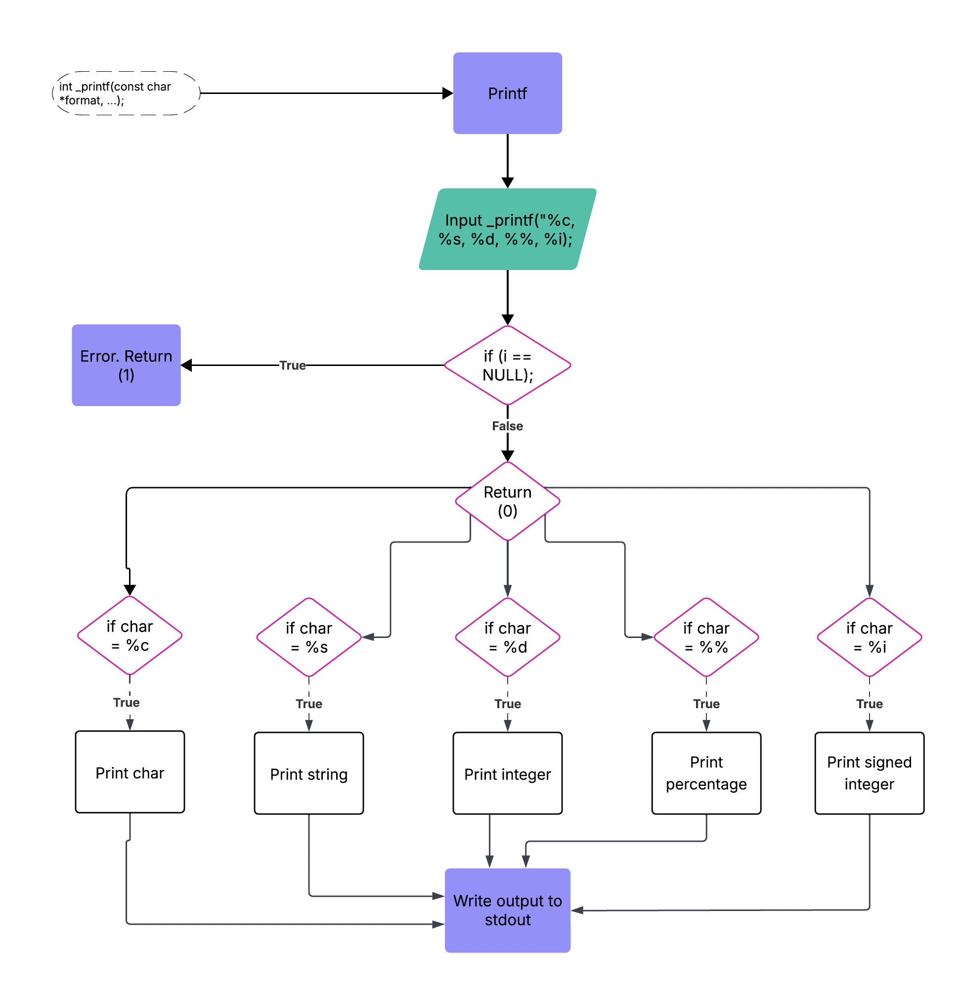

# _printf

## About this project
This group project recreates the standard library's printf function. The following conversion specifiers are used: 

| Specifier | Description |
|-----------|---------|
| `c` | prints a single character |
| `s` | prints a string |
| `%` | prints a percent on its own (not modifier) |
| `d` | prints decimal numbers|
| `i` | prints integers |


## Project files
| File | Description |
|------|-------------|
| main.h | The header file: contains prototypes and structure of specifiers |
| _printf.c| The project function: our recreation of the standard library `printf` |
| _putchar.c|| Function file: similar to standard library's `putchar`
| print_char.c| Function file: contains the function used to print characters|
| print_int.c| Function file: contains the function used to print integers|
| print_percent.c|Function file: contains the function used to print percent|
| print_string.c|Function file: contains the function used to print strings| 


## Usage
* Prints a string to the standard output following a given format
* Returns the number of characters in the output string upon success. Otherwise, the function will return -1.
```
_printf("input");
```


### Prototype
```
int _printf(const char *format, ...)
```


### Compilation
```
$ gcc -Wall -Werror -Wextra -pedantic *.c
```


### Flowchart


### Manual page
```
man ./man_3_printf
```  


## Authors
- [Ashleigh Henna](https://github.com/ashleigh6734)
- [Karen Andrianaharison](https://github.com/Kandrianaha)
- [Tran Nguyen](https://github.com/tranbnn)

